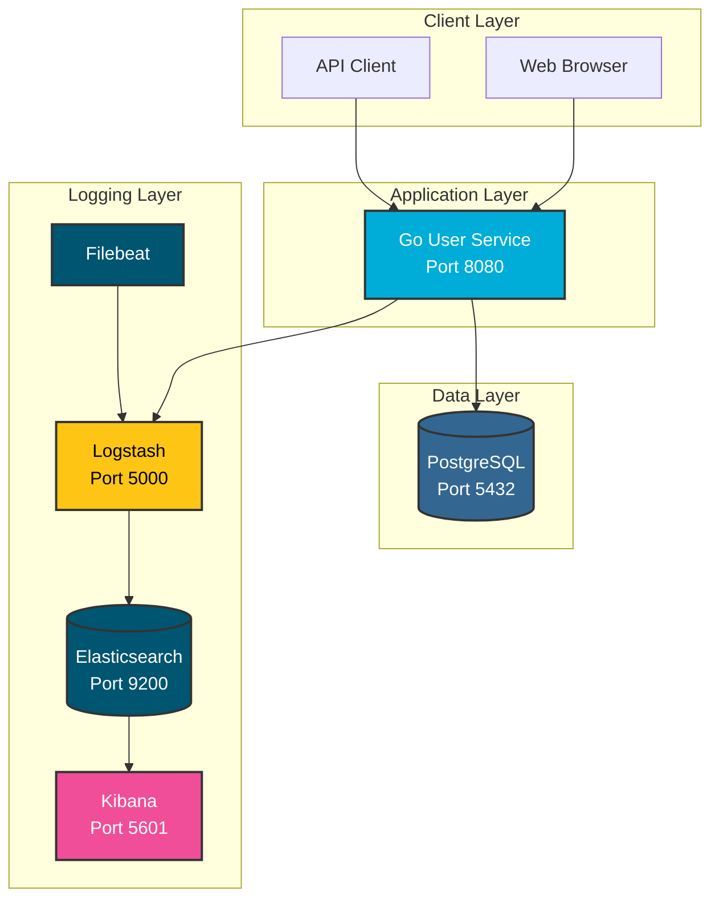

# 🚀 ELK Stack with Go User Service

<div align="center">


**Modern microservice architecture with centralized logging using ELK Stack**

</div>


---

## 📋 Table of Contents

- [Overview](#overview)
- [Architecture](#architecture)
- [Features](#features)
- [Tech Stack](#tech-stack)
- [Quick Start](#quick-start)
- [API Endpoints](#api-endpoints)
- [Monitoring & Logging](#monitoring--logging)
- [Development](#development)
- [Contributing](#contributing)

---

## 🎯 Overview

This project demonstrates a **complete microservice architecture** with:
- **Go REST API** for user management
- **PostgreSQL** database with GORM
- **ELK Stack** (Elasticsearch, Logstash, Kibana) for centralized logging
- **Docker Compose** for easy deployment
- **Structured logging** with Zap logger
- **Performance monitoring** and analytics

---

## 🏗️ Architecture

<div align="center">



</div>

---

## ✨ Features

### 🔐 User Management
- **CRUD operations** for users
- **Password hashing** with bcrypt
- **Email & username uniqueness** validation
- **Soft delete** support
- **Pagination** for user lists

### 📊 Logging & Monitoring
- **Structured JSON logging** with Zap
- **Request/response logging** with middleware
- **Performance metrics** (response time, status codes)
- **Business event logging** (user creation, updates)
- **Centralized log storage** in Elasticsearch

### 🚀 DevOps Features
- **Docker containerization**
- **Health checks** for all services
- **Environment-based configuration**
- **Graceful shutdown** handling
- **Makefile** for common operations

---

## 🛠️ Tech Stack

| Component | Technology | Version |
|-----------|------------|---------|
| **Backend** | Go | 1.23+ |
| **Web Framework** | Gin | 1.9.1 |
| **ORM** | GORM | 1.25.5 |
| **Database** | PostgreSQL | 15 |
| **Logger** | Zap | 1.27.0 |
| **Search Engine** | Elasticsearch | 8.11.0 |
| **Log Processor** | Logstash | 8.11.0 |
| **Visualization** | Kibana | 8.11.0 |
| **Containerization** | Docker | 20.10+ |

---

## 🚀 Quick Start

### Prerequisites
- Docker & Docker Compose
- Make (optional, for convenience)

### 1. Clone Repository
```bash
git clone https://github.com/ozturkeniss/ELK-Stackgin.git
cd ELK-Stackgin
```

### 2. Start All Services
```bash
# Using Docker Compose
docker-compose up -d

# Or using Makefile
make setup
```

### 3. Verify Services
```bash
# Check service status
docker-compose ps

# Test Go API
curl http://localhost:8080/health

# Test Elasticsearch
curl http://localhost:9200/_cluster/health

# Open Kibana
open http://localhost:5601
```

### 4. Create Test User
```bash
curl -X POST http://localhost:8080/users \
  -H "Content-Type: application/json" \
  -d '{
    "username": "testuser",
    "email": "test@example.com",
    "password": "123456",
    "first_name": "Test",
    "last_name": "User",
    "age": 25
  }'
```

---

## 🔌 API Endpoints

| Method | Endpoint | Description |
|--------|----------|-------------|
| `GET` | `/health` | Service health check |
| `POST` | `/users` | Create new user |
| `GET` | `/users` | Get all users (paginated) |
| `GET` | `/users/:id` | Get user by ID |
| `GET` | `/users/email` | Get user by email |
| `PUT` | `/users/:id` | Update user |
| `DELETE` | `/users/:id` | Delete user (soft delete) |

---

## 📊 Monitoring & Logging

### Log Structure
```json
{
  "level": "INFO",
  "timestamp": "2025-08-27T23:00:28.473Z",
  "msg": "User created successfully",
  "request_id": "20250827230028-PFIyvAFJ",
  "user_id": 1,
  "username": "dockeruser",
  "email": "docker@example.com",
  "response_time": "63.701874ms",
  "status_code": 201,
  "service": "user-service",
  "environment": "development"
}
```

### Kibana Dashboard Setup
1. **Open Kibana**: http://localhost:5601
2. **Create Index Pattern**: `go-app-logs-*`
3. **Time Field**: `@timestamp`
4. **Discover**: View and search logs
5. **Dashboard**: Create visualizations

### Available Metrics
- **Response times** by endpoint
- **Error rates** and status codes
- **User activity** patterns
- **Database performance**
- **Service health** status

---

## 🛠️ Development

### Project Structure
```
elk-stack-user/
├── cmd/
│   └── main.go              # Application entry point
├── internal/
│   ├── database/            # Database connection & migrations
│   ├── handler/             # HTTP handlers
│   ├── logger/              # Logging configuration
│   ├── middleware/          # HTTP middleware
│   ├── model/               # Data models
│   ├── repository/          # Data access layer
│   ├── router/              # Route configuration
│   └── service/             # Business logic
├── logstash/                # Logstash configuration
├── filebeat/                # Filebeat configuration
├── docker-compose.yml       # Service orchestration
├── Dockerfile               # Go app containerization
└── Makefile                 # Development commands
```

### Environment Variables
```bash
# Database
DB_HOST=postgres
DB_PORT=5432
DB_USER=postgres
DB_PASSWORD=postgres123
DB_NAME=user_service

# Application
ENV=development
PORT=8080

# ELK Stack
ELK_LOGSTASH_ADDR=logstash:5000
```

### Common Commands
```bash
# Build and start
make setup

# View logs
make logs
make logs-app
make logs-elasticsearch

# Test services
make test
make test-elasticsearch
make test-kibana

# Clean up
make clean
make down
```

---

## 🤝 Contributing

1. **Fork** the repository
2. **Create** a feature branch (`git checkout -b feature/amazing-feature`)
3. **Commit** your changes (`git commit -m 'Add amazing feature'`)
4. **Push** to the branch (`git push origin feature/amazing-feature`)
5. **Open** a Pull Request

---

## 📄 License

This project is licensed under the MIT License - see the [LICENSE](LICENSE) file for details.

---

## 🙏 Acknowledgments

- [Gin Web Framework](https://github.com/gin-gonic/gin)
- [GORM](https://gorm.io/)
- [Zap Logger](https://github.com/uber-go/zap)
- [Elastic Stack](https://www.elastic.co/)

---

<div align="center">

**Made with ❤️ and ☕**

[](https://github.com/ozturkeniss/ELK-Stackgin)
[](https://github.com/ozturkeniss/ELK-Stackgin)

</div>
